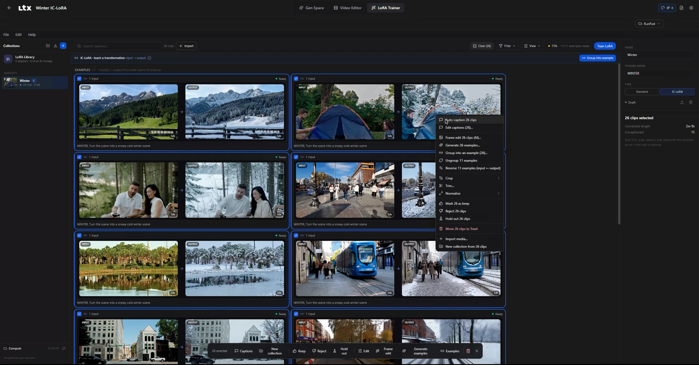
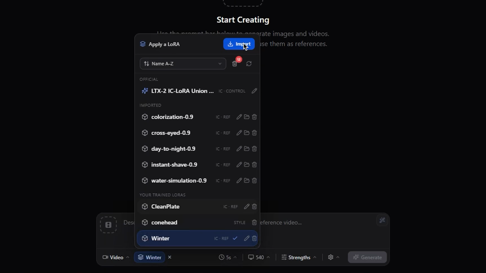
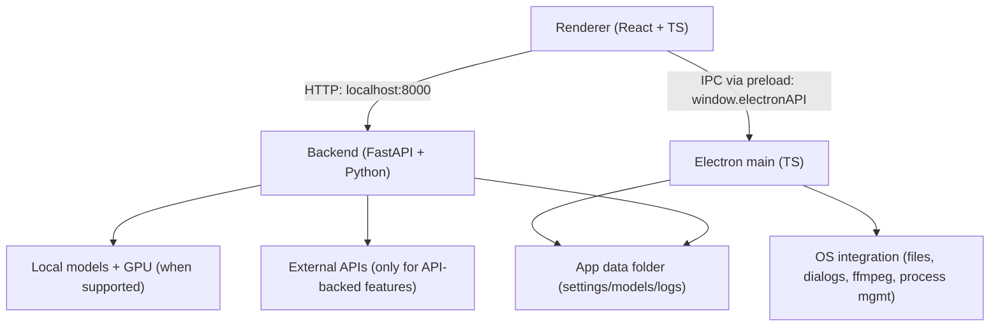

# LTX Desktop

> **Unofficial fork.** This repository is forked from
> [Lightricks/LTX-Desktop](https://github.com/Lightricks/LTX-Desktop) and is not
> an official Lightricks release. It preserves upstream attribution while adding
> additional LoRA training and workflow tools.

LTX Desktop is an open-source desktop app for generating videos with
LTX models—locally on supported Windows/Linux NVIDIA GPUs, with an API mode for
unsupported hardware and macOS.

> **Status: Beta.** Expect breaking changes.
> Frontend architecture is under active refactor; large UI PRs may be declined for now (see [`CONTRIBUTING.md`](docs/CONTRIBUTING.md)).

<p align="center">
  <strong>Gen Space</strong><br>
  
</p>

<p align="center">
  <strong>Video Editor</strong><br>
  
</p>

<p align="center">
  <strong>LoRA Trainer</strong><br>
  
</p>

<p align="center">
  <strong>Apply LoRA in Gen Space</strong><br>
  
</p>

## Features

- Text-to-video generation
- Image-to-video generation
- Audio-to-video generation
- Video edit generation (Retake)
- Video Editor Interface
- Video Editing Projects
- Standard and IC-LoRA dataset creation, validation, training, recovery, and export
- Local WSL2 or RunPod training with live GPU availability and billing controls
- LoRA library, examples, validation media, prompt templates, and Gen Space inference

## Local vs API mode

| Platform / hardware | Generation mode | Notes |
| --- | --- | --- |
| Windows + CUDA GPU with **≥16GB VRAM** | Local generation | Downloads model weights locally |
| Windows (no CUDA, <16GB VRAM, or unknown VRAM) | API-only | **LTX API key required** |
| Linux + CUDA GPU with **≥16GB VRAM** | Local generation | Downloads model weights locally |
| Linux (no CUDA, <16GB VRAM, or unknown VRAM) | API-only | **LTX API key required** |
| macOS (Apple Silicon builds) | API-only | **LTX API key required** |

In API-only mode, available resolutions/durations may be limited to what the API supports.

## System requirements

### Windows (local generation)

- Windows 10/11 (x64)
- NVIDIA GPU with CUDA support and **≥16GB VRAM** (more is better)
- 16GB+ RAM (32GB recommended)
- **160GB+ free disk space** (for model weights, Python environment, and outputs)

### Linux (local generation)

- Ubuntu 22.04+ or similar distro (x64 or arm64)
- NVIDIA GPU with CUDA support and **≥16GB VRAM** (more is better)
- NVIDIA driver installed (PyTorch bundles the CUDA runtime)
- 16GB+ RAM (32GB recommended)
- Plenty of free disk space for model weights and outputs

### macOS (API-only)

- Apple Silicon (arm64)
- macOS 13+ (Ventura)
- Stable internet connection

## Install

Download the newest installer from this repository's
**[official Releases page](https://github.com/MountainPlatform300/LTX-Desktop/releases)**:

- **Windows x64:** `LTX-Desktop-Setup.exe`
- **macOS Apple Silicon:** `LTX-Desktop-arm64.dmg`
- **Linux x64:** `.deb` for Ubuntu/Debian or `.AppImage` for other compatible distributions

> **Unsigned beta:** Windows SmartScreen and macOS Gatekeeper will
> show warnings because these installers are not yet Authenticode-signed or
> Apple-notarized. Confirm the filename and official repository before
> proceeding. Do not use installers from mirrors, comments, or chat links.

See the **[step-by-step download and installation guide](docs/DOWNLOAD.md)** for
GUI instructions, OS warning screens, first-run downloads, and optional
checksum verification.

### Run from source (advanced)

Running from source is intended for developers and advanced users. It creates a
development checkout rather than installing a packaged desktop release.

Install Git, Node.js 24, pnpm 10.30.3, `uv`, and Python 3.13.12, then run:

```bash
git clone https://github.com/MountainPlatform300/LTX-Desktop.git
cd LTX-Desktop
pnpm setup:dev
pnpm dev
```

The setup step downloads the JavaScript and Python dependencies, which can use
significant disk space. For development commands, see
[Development setup](#development-quickstart). To create a packaged application
from source, see the [installer build guide](docs/INSTALLER.md).

## First run & data locations

LTX Desktop stores app data (settings, models, logs) in:

- **Windows:** `%LOCALAPPDATA%\LTXDesktop\`
- **macOS:** `~/Library/Application Support/LTXDesktop/`
- **Linux:** `$XDG_DATA_HOME/LTXDesktop/` (default: `~/.local/share/LTXDesktop/`)

Model weights are downloaded into the `models/` subfolder (this can be large and may take time).

On first launch you may be prompted to review/accept model license terms (license text is fetched from Hugging Face; requires internet).

Text encoding: to generate videos you must configure text encoding:

- **LTX API key** (cloud text encoding) — **text encoding via the API is completely FREE** and highly recommended to speed up inference and save memory. Generate a free API key at the [LTX Console](https://console.ltx.video/). [Read about API-key authentication](https://docs.ltx.video/authentication).
- **Local Text Encoder** (extra download; enables fully-local operation on supported Windows hardware) — if you don't wish to generate an API key, you can encode text locally via the settings menu.

## API keys, cost, and privacy

### LTX API key

The LTX API is used for:

- **Cloud text encoding and prompt enhancement** — **FREE**; text encoding is highly recommended to speed up inference and save memory
- API-based video generations (required on macOS and on unsupported Windows hardware) — paid
- Retake — paid

An LTX API key is required in API-only mode, but optional on Windows/Linux local mode if you enable the Local Text Encoder.

Generate a FREE API key at the [LTX Console](https://console.ltx.video/). Text encoding is free; video generation API usage is paid. [Read about API-key authentication](https://docs.ltx.video/authentication).

When you use API-backed features, prompts and media inputs are sent to the API service. API credentials are encrypted at rest using OS-backed key storage and are never returned by the settings API.

### fal API key (optional)

Used for Z Image Turbo text-to-image generation in API mode. When enabled, image generation requests are sent to fal.ai.

Create an API key in the [fal dashboard](https://fal.ai/dashboard/keys).

### Gemini API key (optional)

Used for AI prompt suggestions. When enabled, prompt context and frames may be sent to Google Gemini.

## Architecture

LTX Desktop is split into three main layers:

- **Renderer (`frontend/`)**: TypeScript + React UI.
  - Calls the local backend over HTTP at `http://localhost:8000`.
  - Talks to Electron via the preload bridge (`window.electronAPI`).
- **Electron (`electron/`)**: TypeScript main process + preload.
  - Owns app lifecycle and OS integration (file dialogs, native export via ffmpeg, starting/managing the Python backend).
  - Security: renderer is sandboxed (`contextIsolation: true`, `nodeIntegration: false`).
- **Backend (`backend/`)**: Python + FastAPI local server.
  - Orchestrates generation, model downloads, and GPU execution.
  - Calls external APIs only when API-backed features are used.



## Development (quickstart)

Prereqs:

- Node.js 24
- pnpm 10.30.3
- `uv` (Python package manager)
- Python 3.13.12
- Git

Setup:

```bash
pnpm setup:dev
```

Run:

```bash
pnpm dev
```

Debug:

```bash
pnpm dev:debug
```

`dev:debug` starts Electron with inspector enabled and starts the Python backend with `debugpy`.

Typecheck:

```bash
pnpm typecheck
```

Backend tests:

```bash
pnpm backend:test
```

Building installers:
- See [`INSTALLER.md`](docs/INSTALLER.md)

## Telemetry

This fork retains upstream minimal, pseudonymous usage analytics (app version,
platform, fork identifier, and a random installation ID). Events are sent to
Lightricks; no prompts, media, credentials, or paths are included. Analytics is
enabled by default and can be disabled in **Settings > General > Usage
Analytics**. See [`TELEMETRY.md`](docs/TELEMETRY.md) for connection-metadata and
server-retention caveats.

## Docs

- [`DOWNLOAD.md`](docs/DOWNLOAD.md) — beginner-friendly download, installation, and verification
- [`INSTALLER.md`](docs/INSTALLER.md) — building installers
- [`RELEASE.md`](docs/RELEASE.md) — release gates, installer qualification, and artifact evidence
- [`RELEASE_NOTES_1.1.0-beta.2.md`](docs/RELEASE_NOTES_1.1.0-beta.2.md) — unsigned installer beta notes
- [`ANNOUNCEMENT.md`](docs/ANNOUNCEMENT.md) — reviewed launch-post draft and publication checklist
- [`TELEMETRY.md`](docs/TELEMETRY.md) — telemetry and privacy
- [`NETWORK_SERVICES.md`](docs/NETWORK_SERVICES.md) — external services and data flows
- [`LORA_TRAINER.md`](docs/LORA_TRAINER.md) — dataset, training, RunPod, billing, and export workflows
- [`SECURITY.md`](SECURITY.md) — security model and private vulnerability reporting
- [`backend/architecture.md`](backend/architecture.md) — backend architecture

## Contributing

See [`CONTRIBUTING.md`](docs/CONTRIBUTING.md).

## License

Apache-2.0 — see [`LICENSE.txt`](LICENSE.txt).

Third-party notices (including model licenses/terms): [`NOTICES.md`](NOTICES.md).

Model weights are downloaded separately and may be governed by additional licenses/terms.
