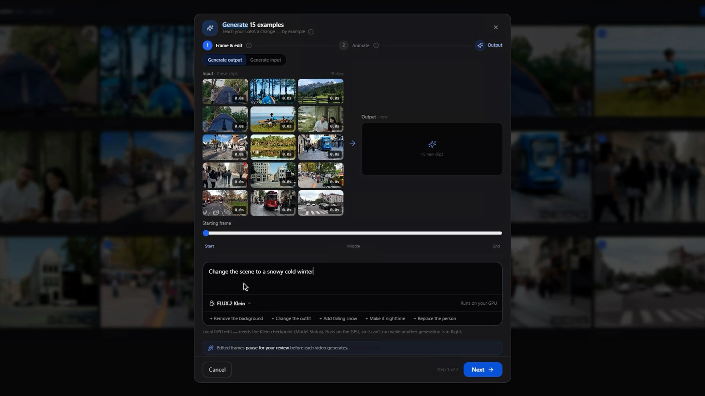
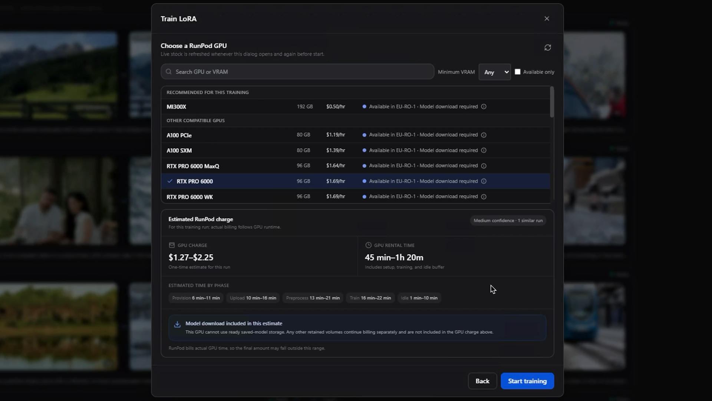
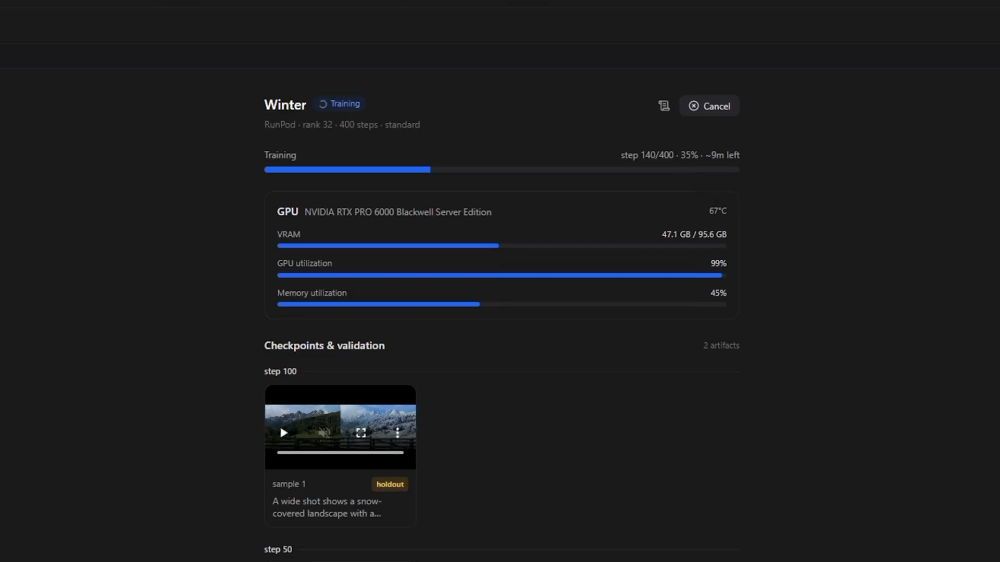

# LoRA Trainer

This fork includes an end-to-end trainer for standard LTX-2 LoRAs and
paired video-to-video IC-LoRAs. Training can run locally through WSL2 where
supported or on a user-owned RunPod account.

## Before training

- Use media you are authorized to process and redistribute.
- Keep subjects, captions, and visual intent consistent across the dataset.
- Review every generated caption; a caption describes what should be learned.
- IC-LoRA datasets require aligned input/reference and target pairs.
- Cloud GPU, storage, captioning, and media-generation services may incur costs.

## Workflow

1. Open **LoRA Trainer** and create a standard or IC-LoRA dataset.
2. Import clips, inspect quality warnings, trim/crop where needed, and review
   captions.
3. For IC-LoRA, pair each target with the correct reference/input clip.
4. Choose **Train LoRA**.
5. Keep **Auto** for the official dataset-compatible recommendation, select one
   of the official profiles, or create a custom profile.
6. Choose local WSL2 or RunPod compute and review the GPU price, estimated time,
   storage policy, and expected total cost.
7. Monitor setup, preprocessing, training checkpoints, validation media, and
   current pod billing from the run and Compute panels.
8. After completion, stop or terminate cloud compute promptly. Verify the
   countdown before relying on automatic cleanup.
9. Review the run summary and validation outputs, then publish or export the
   selected checkpoint.

Generate examples to validate the transformation before committing to a
training run:

## Official profiles

Built-in profiles mirror the official LTX-2 trainer recipes and are read-only:

- **Standard LoRA**
- **Low VRAM**
- **IC-LoRA**

Duplicate a profile or create a new profile for experimentation. Custom settings
are snapshotted into each run, so later profile edits do not change old runs.

## RunPod safety

- The GPU list and availability are refreshed from RunPod before submission.
- The app acts only on pods and cache volumes it created.
- **Stop** ends GPU billing while retaining supported workspace storage.
- **Terminate** deletes an ephemeral pod and its temporary disk.
- Persistent network volumes continue to incur storage charges after a pod is
  stopped or terminated.
- Check the RunPod console if the app loses connectivity during cleanup.

RunPod availability and pricing are live; the values below are an example, not
a quote:

## Recovery

- If a selected GPU becomes unavailable, choose another GPU and review the
  preserved run settings before continuing.
- Failed or cancelled runs can resume from the latest discovered checkpoint
  when the remote artifacts still exist.
- Archived datasets and runs remain recoverable until permanently deleted.
- Never assume a cloud pod stopped solely because training ended; verify its
  state in the Compute panel or RunPod console.

Monitor utilization, checkpoints, and validation outputs while training:

## Export and use

Completed LoRAs can be published to the in-app library or exported with their
training configuration, run summary, examples, and model card. Safetensors is
the supported weight format. Follow the target tool's documentation when using
the adapter in ComfyUI or another inference workflow.

Apply an official, imported, or trained LoRA directly in Gen Space:

## Privacy and credentials

RunPod, Hugging Face, Gemini, fal, Pexels, and LTX API credentials are encrypted
at rest using OS-backed key storage. Prompts or media are sent to an external
service only when its corresponding feature is used. See
[Telemetry](TELEMETRY.md) and [Security](../SECURITY.md).
